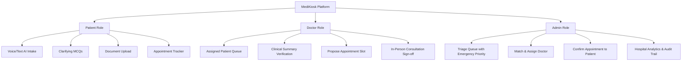
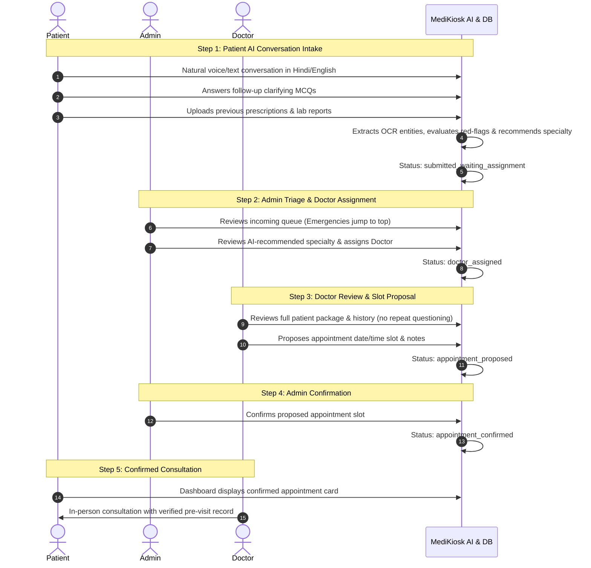

# MediKiosk — System Architecture & Workflow Specifications

MediKiosk is an AI-assisted patient intake and doctor appointment platform built around a linear 5-step clinical lifecycle and a 3-role permission model.

---

## 1. Role System Architecture

The application defines exactly **three user roles**:

---

## 2. Linear End-to-End Workflow (5 Steps)

---

## 3. Queue Ordering & Emergency Prioritization

1. **Default Ordering:** First-come, first-served based on intake submission timestamp.
2. **Emergency Jump:** When an intake triggers a clinical red-flag (e.g. Acute Coronary Syndrome, severe pain >=7/10 with diaphoresis), `is_emergency = true`.
3. **Queue Behavior:** The database query and UI immediately place all emergency encounters at the **top of the Admin queue** with glowing visual badges and priority alerts.
