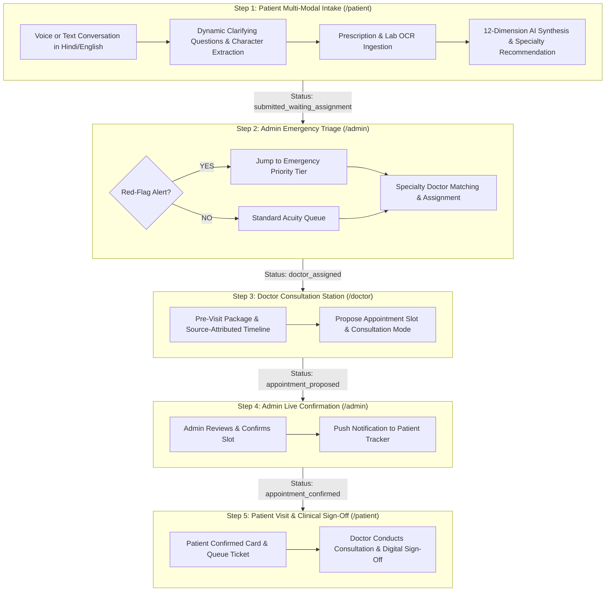

# MediKiosk — AI-Assisted Clinical Intake & Autonomous Triage Platform

<div align="center">

[](https://nextjs.org/)
[](https://www.typescriptlang.org/)
[](https://tailwindcss.com/)
[](https://supabase.com/)
[](https://vercel.com/)
[](LICENSE)

### 🌐 [**Live Demo Deployment on Vercel**](https://medi-ki-osk.vercel.app/)
*(Live Application URL: [https://medi-ki-osk.vercel.app/](https://medi-ki-osk.vercel.app/))*

**An intelligent, multi-modal clinical intake kiosk and triage workstation connecting Patients, Doctors, and Hospital Administrators.**

[Explore Features](#-key-features) • [Clinical Workflow](#-5-stage-clinical-workflow) • [Role Portals](#-role-portals--credentials) • [Getting Started](#-local-development-setup) • [Environment Config](#-environment-variables)

</div>

---

## 📌 Executive Summary

**MediKiosk** is a next-generation hospital intake system engineered to eliminate clinical administrative burdens and bridge the patient-provider communication gap. By combining **bilingual speech recognition (Hindi / English)**, **dynamic clinical interviews (OLDCARTS / OPQRST framework)**, **OCR document parsing**, and **Manchester Acuity emergency triage**, MediKiosk delivers high-precision clinical packages directly to specialists before the patient ever enters the examination room.

---

## ⚡ 5-Stage Clinical Workflow



---

## 🌟 Key Features

### 🎙️ 1. Multi-Modal Bilingual Voice Intake
- **Dual-Language Speech Engine:** Full voice-in and voice-out support for **Hindi (`hi-IN`)** and **English (`en-IN`)** with neural audio fallback.
- **Adaptive Clinical Ontology:** 5-turn structured interview covering Chief Complaint, Onset, Character, Radiation, Severity, and Associated Symptoms without premature termination.
- **Real-Time Dynamic MCQs:** Intelligent single-tap multiple-choice chips generated contextually for elderly or voice-fatigued patients.

### 📄 2. Document OCR & Clinical Reconciliation
- **Prescription & Panel Ingestion:** Upload camera captures or PDFs of past medical files.
- **Entity Extraction:** Automated parsing of active medications, dosages, frequency, and abnormal biomarker ranges with source citation badges.

### 🚨 3. Red-Flag Sentinel & Emergency Triage
- **Acuity Scoring:** Real-time detection of high-risk symptoms (chest pain radiating to arm, acute dyspnea, stroke signs, severe trauma).
- **Admin Emergency Override:** Critical patients bypass standard queues, triggering visual strobe alerts and immediate specialist allocation.

### 🏥 4. Doctor Workstation & Pre-Consultation Package
- **Pre-Visit Briefing:** Eliminates repeat questioning by presenting doctors with structured history of present illness (HPI), medication timelines, and differential diagnoses.
- **Slot Proposal & Mode Selection:** Physicians propose in-person, tele-consult, or emergency bed slots with clinical directives.

### 🛡️ 5. Role-Based Access Control (RBAC) & Auditability
- **Server-Side Security:** Next.js Edge middleware enforcing role isolation for `/patient`, `/doctor`, and `/admin`.
- **Tamper-Evident Audit Trail:** Every status mutation, assignment, and clinical sign-off is logged with timestamps and operator IDs.

---

## 👥 Role Portals & Demo Credentials

| Role | Description | Demo Credentials |
|---|---|---|---|
| **Patient** | Spoken/typed symptom intake, document upload, and live appointment tracker. | Direct Access (Public Kiosk) |
| **Doctor** | Clinical package review, source timeline inspection, and appointment proposal. | **Username:** `doctor`<br>**Password:** `doctor123` |
| **Admin** | Emergency triage queue, specialist doctor assignment, and throughput metrics. | **Username:** `admin`<br>**Password:** `admin123` |
| **Auth Hub** | Centralized credential-based authentication and role switcher. | — |

---

## 🛠️ Technology Architecture

```
├── src/
│   ├── app/
│   │   ├── admin/             # Admin Triage Queue, Staff Directory & Analytics
│   │   ├── api/ai/            # Chat & Clinical Summary LLM Synthesis Routes
│   │   ├── auth/login/        # Role-Based Login & Session Management
│   │   ├── doctor/            # Doctor Clinical Workstation & Slot Proposals
│   │   ├── patient/           # Voice AI Intake Kiosk & Appointment Tracker
│   │   └── layout.tsx         # Global Theme, Navigation & Toast Providers
│   ├── components/
│   │   ├── admin/             # Triage Boards, Doctor Assignment Modals
│   │   ├── clinical/          # Acuity Badges, Source Citation Tags, Timelines
│   │   ├── doctor/            # HPI Summaries, Slot Proposer Controls
│   │   ├── patient/           # Audio Waveforms, Dynamic MCQ Chips, Document OCR
│   │   └── ui/                # Accessible, high-contrast Tailwind UI primitives
│   ├── lib/
│   │   ├── db/                # Supabase Client & Local Fallback Data Store
│   │   ├── ontology/          # Clinical Rules, Red-Flag Sentinels & Interview Engine
│   │   ├── providers/         # Groq, Gemini, Anthropic & Mock AI Provider Interfaces
│   │   └── speech/            # Web Speech API Synthesis & Recognition Adapters
│   └── middleware.ts          # Edge RBAC Security & Cookie-Based Guard
```

---

## 🚀 Local Development Setup

### Prerequisites
- **Node.js:** `v18.18.0` or higher
- **Package Manager:** `npm` or `yarn` / `pnpm`

### 1. Clone the Repository
```bash
git clone https://github.com/shivam137421/MediKiOsk.git
cd MediKiOsk
```

### 2. Install Dependencies
```bash
npm install
```

### 3. Configure Environment Variables
Create a `.env.local` file by copying the template:
```bash
cp .env.example .env.local
```
*(Configure AI provider keys such as `GROQ_API_KEY`, `GEMINI_API_KEY`, or `ANTHROPIC_API_KEY` for live LLM reasoning, or leave default mock mode for fully offline evaluation).*

### 4. Run the Development Server
```bash
npm run dev
```
Open **[http://localhost:3000](http://localhost:3000)** in your browser.

### 5. Verification & Tests
```bash
# Validate TypeScript typing
npm run typecheck

# Production build verification
npm run build
```

---

## ⚙️ Environment Variables

| Variable | Required | Default | Description |
|---|---|---|---|
| `NEXT_PUBLIC_APP_NAME` | No | `"MediKiosk Clinical Intake"` | Display title of the application |
| `NEXT_PUBLIC_APP_URL` | No | `"http://localhost:3000"` | Canonical base URL |
| `NEXT_PUBLIC_DEFAULT_LOCALE` | No | `"en"` | Default language (`"en"` or `"hi"`) |
| `NEXT_PUBLIC_ENABLE_AYUSH_MODE`| No | `"true"` | Enable Ayurvedic & Integrative Medicine routing |
| `NEXT_PUBLIC_SUPABASE_URL` | Optional | `""` | Supabase cloud database endpoint |
| `NEXT_PUBLIC_SUPABASE_ANON_KEY`| Optional | `""` | Supabase public anonymous API key |
| `AI_PROVIDER` | No | `"mock"` | Active LLM engine (`"groq"`, `"gemini"`, `"anthropic"`, `"mock"`) |
| `GROQ_API_KEY` | Optional | `""` | Groq Cloud API key for ultra-fast Llama-3 inference |
| `GEMINI_API_KEY` | Optional | `""` | Google Gemini API key |

---

## 📄 License & Attribution

Distributed under the **MIT License**. See `LICENSE` for more information.

Built with ❤️ for resilient, accessible healthcare infrastructure.
